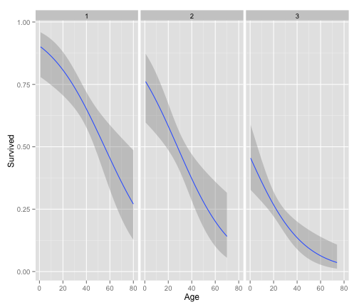
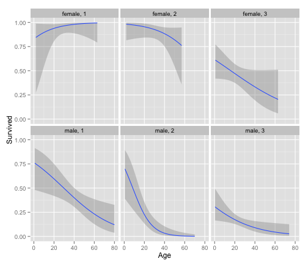
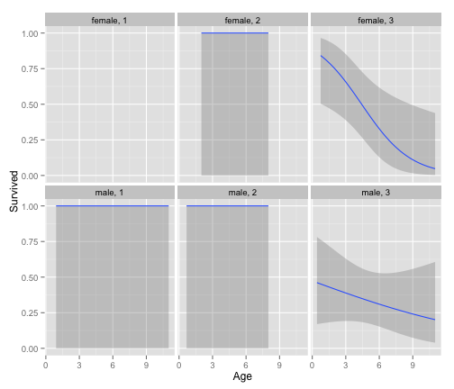
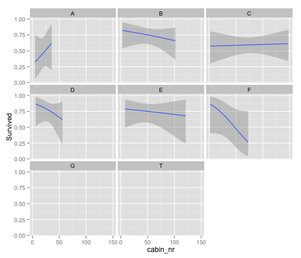

Titanic Visualizations
========================================================

This file will provide some basic data visualizations for the titanic dataset posted on Kaggle.

Author: R. Calen Walshe
Date: October 22, 2015
-------------------------

VARIABLE DESCRIPTIONS:
survival        Survival
                (0 = No; 1 = Yes)
pclass          Passenger Class
                (1 = 1st; 2 = 2nd; 3 = 3rd)
name            Name
sex             Sex
age             Age
sibsp           Number of Siblings/Spouses Aboard
parch           Number of Parents/Children Aboard
ticket          Ticket Number
fare            Passenger Fare
cabin           Cabin
embarked        Port of Embarkation
                (C = Cherbourg; Q = Queenstown; S = Southampton)

SPECIAL NOTES:
Pclass is a proxy for socio-economic status (SES)
 1st ~ Upper; 2nd ~ Middle; 3rd ~ Lower

Age is in Years; Fractional if Age less than One (1)
 If the Age is Estimated, it is in the form xx.5

With respect to the family relation variables (i.e. sibsp and parch)
some relations were ignored.  The following are the definitions used
for sibsp and parch.

Sibling:  Brother, Sister, Stepbrother, or Stepsister of Passenger Aboard Titanic
Spouse:   Husband or Wife of Passenger Aboard Titanic (Mistresses and Fiances Ignored)
Parent:   Mother or Father of Passenger Aboard Titanic
Child:    Son, Daughter, Stepson, or Stepdaughter of Passenger Aboard Titanic

Other family relatives excluded from this study include cousins,
nephews/nieces, aunts/uncles, and in-laws.  Some children travelled
only with a nanny, therefore parch=0 for them.  As well, some
travelled with very close friends or neighbors in a village, however,
the definitions do not support such relations.


#### Some basics.
1. What proportion survived?
2. What characteristics do survivors have?
    * a. What proportion of survivors come from different social classes?
      * As we would expect, the lower your class the worse you chances. 
    * b. Gender and survivors.
      * Males did not do so well. This likely is reflective of the women and children first policy. Follow ups could definitely be done here. For example, are super high status males given priority. There could be an interaction between class and male. Also, we should take into account that male children are probably equally likely to survive as female children. 
    * c. Age.
      * Notes. There are a lot of people who we don't have age information for. Can we collect some age data on them? As we can see from the analysis age is an important predictor of survivability. Would be worthwhile trying to interpolate these data points.
      * What about age and class?
        * Yep. This is interesting. For males, at any class, the older you are the lower your chances of surviving. However, for females, if you are in first class your chances of surviving go up as you get older.
          * Ideas: 1) Can we get more fine grained information on class from the ticket price or cabin location or name (titles)
        * However, our linear model might be missing something important. Maybe this gender effect is absent for really young children. In 2.b.1 this supports that conclusion. Both males and females of 1 and 2nd class have a 100% survival rate, although we should probably note that this may not be a strong pattern as there is a lack of data. Once we get into 3rd class things change. There is a general trend to do poorly as they get older. Basically, this points to the need for some child specific modelling, especially for third class.
            * Ideas: 1) Parents and siblings. If they have multiple parents on board they will be more likely to survive. Do they have siblings. What are their ages? Older siblings might help them to get to the top deck. Younger siblings might have been given priority over them. 
    * d. What about the deck. Being below deck would lower the chances of survival.

```
##   mean(Survived)
## 1      0.3838384
```

```
## Source: local data frame [3 x 2]
## 
##   Pclass class_prop
## 1      1  0.6296296
## 2      2  0.4728261
## 3      3  0.2423625
```

```
## Source: local data frame [2 x 2]
## 
##      Sex gender_prop
## 1 female   0.7420382
## 2   male   0.1889081
```

   

```
## Source: local data frame [8 x 3]
## 
##   cabin_category count surv_prop
## 1              A    15 0.4666667
## 2              B    47 0.7446809
## 3              C    59 0.5932203
## 4              D    33 0.7575758
## 5              E    32 0.7500000
## 6              F    13 0.6153846
## 7              G     4 0.5000000
## 8              T     1 0.0000000
```

```
## Warning: Removed 3 rows containing missing values (stat_smooth).
```

```
## Warning: Removed 1 rows containing missing values (stat_smooth).
```

 

